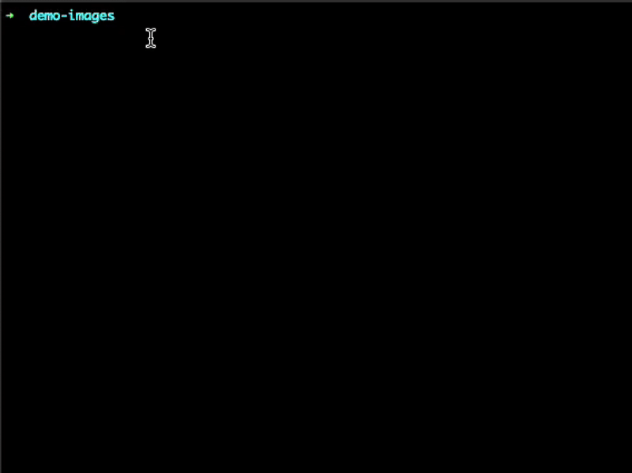

# PhotoRoom CLI

An unofficial command-line interface for the PhotoRoom API that provides powerful image editing and background removal capabilities through an interactive terminal interface.



## 🚀 Quick Start (TLDR)

### Try it instantly with npx (no installation required):

```bash
# Run the interactive CLI
npx photoroom-cli

# Check account details (requires API key)
PHOTOROOM_API_KEY=your_api_key npx photoroom-cli account

# Run with debug mode
npx photoroom-cli --debug
```

### Or install globally:

```bash
# Install once
npm install -g photoroom-cli

# Then use anywhere
photoroom-cli
```

### What you can do:

- **Remove backgrounds** from images using AI
- **Edit images** with advanced options (backgrounds, layouts, effects)
- **Check account** details and API credits
- **Manage API keys** securely
- **Process multiple images** in batches

### Need API keys?

1. Sign up at [PhotoRoom](https://photoroom.com/)
2. Get your API keys from the developer dashboard
3. Run `photoroom-cli` and select "Manage API keys" to add them

---

> **⚠️ Disclaimer**: This project is not affiliated with or endorsed by PhotoRoom. It is an independent CLI tool created by Luiz Tanure for personal and educational purposes. All PhotoRoom API functionality, trademarks, and services belong to PhotoRoom.

## 🚀 Features

- **Remove Background**: Remove backgrounds from images using PhotoRoom's AI-powered background removal API
- **Image Editing**: Advanced image editing with background replacement, layout positioning, spacing controls, and export options
- **Account Management**: Check your PhotoRoom API credits and account details
- **API Key Management**: Securely store and manage multiple PhotoRoom API keys (sandbox/live)
- **Interactive Interface**: User-friendly prompts and questionnaires for all operations
- **Debug Mode**: Detailed API request/response logging for troubleshooting
- **Dry Run Mode**: Preview API calls without making actual requests or using credits
- **Batch Processing**: Process multiple images in a single operation
- **File Conflict Handling**: Smart handling of existing files with rename/overwrite options

## 📦 Installation

### From npm (Recommended)

```bash
npm install -g photoroom-cli
```

### From Source

```bash
git clone https://github.com/letanure/photoroom-cli.git
cd photoroom-cli
npm install
npm run build
npm link
```

### Using npx (No Installation Required)

You can run PhotoRoom CLI directly without installing it globally using npx:

```bash
npx photoroom-cli
```

This is useful for:
- One-time usage
- Testing the CLI before installing
- Running on systems where you don't want to install globally
- Always using the latest version

```bash
# Run with command line arguments
npx photoroom-cli account

# Run with environment variable
PHOTOROOM_API_KEY=your_api_key npx photoroom-cli account

# Run with flags
npx photoroom-cli --debug --dry-run
```

## 🔑 Getting Started

### 1. Get PhotoRoom API Keys

You'll need PhotoRoom API keys to use this CLI:

1. Sign up at [PhotoRoom](https://photoroom.com/)
2. Get your API keys from the PhotoRoom developer dashboard
3. You can use both sandbox keys (for testing) and live keys (for production)

### 2. Configure API Keys

Run the CLI and set up your API keys:

```bash
photoroom-cli
```

Select "Manage API keys" → "Add new API key" and follow the prompts.

### 3. Start Using

Once configured, you can:

- Remove backgrounds from images
- Edit images with advanced options
- Check your account details and credits

## 💻 Usage

### Command Line Usage (NEW!)

```bash
# Check account details and credits
photoroom-cli account

# Use with environment variable (no stored key needed)
PHOTOROOM_API_KEY=your_api_key photoroom-cli account

# With debug mode
photoroom-cli account --debug

# Coming soon:
# photoroom-cli remove image.jpg --output result.png
# photoroom-cli edit image.jpg --background "#ffffff"
```

### Interactive Mode

```bash
# Start the interactive CLI (default when no command given)
photoroom-cli

# Show help
photoroom-cli --help

# Enable debug mode
photoroom-cli --debug

# Dry run mode (preview without making requests)
photoroom-cli --dry-run

# Combine flags
photoroom-cli --debug --dry-run
```

### Environment Variables

```bash
# Set API key via environment (takes precedence over stored keys)
export PHOTOROOM_API_KEY=your_api_key_here

# Use in scripts or CI/CD
PHOTOROOM_API_KEY=your_api_key photoroom-cli account
```

### Command Line Options

| Option      | Alias | Description                                             |
| ----------- | ----- | ------------------------------------------------------- |
| `--debug`   | `-d`  | Enable debug mode to log API requests and responses     |
| `--dry-run` |       | Show what requests would be made without executing them |
| `--help`    | `-h`  | Show help information                                   |
| `--version` | `-v`  | Show version number                                     |

## 🖼️ Image Operations

### Remove Background

1. Select "Remove Background" from the main menu
2. Choose images (file picker or URL input)
3. Configure options:
   - Output format (PNG, JPG, WebP)
   - Image size and cropping
   - Background color
   - Channels (RGBA/Alpha)
   - Despill options
4. Set output directory
5. Process images

### Image Editing (Advanced)

1. Select "Image Editing" from the main menu
2. Choose images (file picker or URL input)
3. Configure advanced options:

#### Background Options

- Remove background with PhotoRoom's algorithm
- Set solid colors, gradients, or custom images
- Background prompts for AI generation
- Guidance images and scaling controls
- Seed values for reproducible results

#### Layout & Positioning

- Horizontal/vertical alignment
- Subject scaling (fit/fill)
- Alpha channel handling
- Lighting mode adjustments
- Shadow modes (soft/hard/floating)
- Text removal modes

#### Spacing & Margins

- Uniform or individual margins
- Uniform or individual padding
- Pixel, percentage, or ratio values
- Advanced positioning controls

#### Export Settings

- DPI settings (72-1200)
- Format selection (PNG/JPEG/WebP)
- MIME type specifications
- Size constraints and scaling

## 🔧 Debug & Development

### Debug Mode

Enable detailed logging of all API interactions:

```bash
photoroom-cli --debug
```

Debug mode shows:

- Complete API request details (with hidden API keys)
- Response headers and status codes
- Request/response timing
- Form data field inspection
- Pretty-printed JSON responses

### Dry Run Mode

Preview operations without making actual API calls:

```bash
photoroom-cli --dry-run
```

Dry run mode provides:

- Equivalent curl commands for each API call
- Mock successful responses
- File path predictions
- Credit-free testing of parameters
- API request validation

### Example Debug Output

```bash
━━━━━━━━━━━━━━━━━━━━━━━━━━━━━━━━━━━━━━━━━━━━━━━━━━
🐛 [DEBUG] API REQUEST
━━━━━━━━━━━━━━━━━━━━━━━━━━━━━━━━━━━━━━━━━━━━━━━━━━
📋 Method: POST
🌐 URL: https://image-api.photoroom.com/v2/edit
📄 Headers:
   Accept: image/png, application/json
   x-api-key: YOUR-API-KEY
📦 Body: [FORM DATA]
   Content-Type: multipart/form-data; boundary=...
   Fields: imageFile: [IMAGE FILE], removeBackground, outputSize
```

### Example Curl Command

```bash
🔧 [DRY-RUN] Equivalent curl command:
━━━━━━━━━━━━━━━━━━━━━━━━━━━━━━━━━━━━━━━━━━━━━━━━━━
curl -X POST \
  -H "Accept: image/png, application/json" \
  -H "x-api-key: YOUR-API-KEY" \
  -F "imageFile=@/path/to/your/actual/image.jpg" \
  -F "removeBackground=true" \
  -F "outputSize=auto" \
  "https://image-api.photoroom.com/v2/edit"
━━━━━━━━━━━━━━━━━━━━━━━━━━━━━━━━━━━━━━━━━━━━━━━━━━
```

## 📁 File Management

### Supported Formats

**Input**: JPG, JPEG, PNG, GIF, BMP, WebP, SVG, TIFF
**Output**: PNG, JPG, WebP

### File Conflict Resolution

The CLI automatically handles file conflicts with options to:

- Overwrite existing files
- Rename with incremental numbers
- Apply choice to all files in batch
- Cancel operation

### Batch Processing

Process multiple images efficiently:

- Select multiple files in the file picker
- Consistent settings applied to all images
- Progress tracking with success/error reporting
- Confidence scores for each result

## 🔐 Security

- API keys are stored securely in local configuration
- Keys are never logged in debug output (shown as "YOUR-API-KEY")
- No data is sent to third parties (only PhotoRoom API)
- All network requests use HTTPS

## 🛠️ Development

### Prerequisites

- Node.js 18+ and npm
- TypeScript knowledge for contributions
- PhotoRoom API access

### Setup

```bash
git clone https://github.com/letanure/photoroom-cli.git
cd photoroom-cli
npm install
```

### Development Commands

```bash
# Run in development mode
npm run dev

# Build for production
npm run build

# Run tests
npm test

# Lint code
npm run lint

# Type checking
npm run typecheck
```

### Project Structure

```
src/
├── account-details/     # Account information features
├── image-editing/       # Advanced image editing
├── manage-api-keys/     # API key management
├── remove-background/   # Background removal
├── shared/             # Shared utilities
│   ├── api-client.ts   # PhotoRoom API interface
│   ├── debug.ts        # Debug and dry-run utilities
│   ├── file-conflict-handler.ts
│   ├── image-processor.ts
│   └── question-handler.ts
└── index.ts            # Main CLI entry point
```

## 📊 API Usage & Credits

This CLI consumes PhotoRoom API credits based on your usage:

- Each background removal operation uses credits
- Each image editing operation uses credits
- Account details checking is free
- Dry run mode uses no credits

Monitor your usage through the "Account details" option in the main menu.

## 🤝 Contributing

Contributions are welcome! Please:

1. Fork the repository
2. Create a feature branch (`git checkout -b feature/amazing-feature`)
3. Commit your changes (`git commit -m 'Add amazing feature'`)
4. Push to the branch (`git push origin feature/amazing-feature`)
5. Open a Pull Request

### Guidelines

- Follow the existing code style (enforced by Biome)
- Add tests for new features
- Update documentation as needed
- Ensure all tests pass

## 📄 License

This project is licensed under the MIT License - see the [LICENSE](LICENSE) file for details.

## 🙏 Acknowledgments

- PhotoRoom for providing the powerful image editing API
- The Node.js and TypeScript communities
- Contributors and users of this project

## ❓ FAQ

### Q: Is this an official PhotoRoom tool?

A: No, this is an independent project created by Luiz Tanure and is not affiliated with PhotoRoom.

### Q: Do I need a PhotoRoom account?

A: Yes, you need PhotoRoom API keys which require a PhotoRoom account.

### Q: Can I use this commercially?

A: This CLI tool is MIT licensed, but you must comply with PhotoRoom's API terms of service for commercial usage.

### Q: How do I report bugs?

A: Please open an issue on the [GitHub repository](https://github.com/letanure/photoroom-cli/issues).

### Q: Can I request new features?

A: Yes! Feature requests are welcome through GitHub issues.

---

**Author**: [Luiz Tanure](https://github.com/letanure)  
**Repository**: [photoroom-cli](https://github.com/letanure/photoroom-cli)  
**License**: MIT
